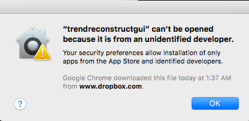
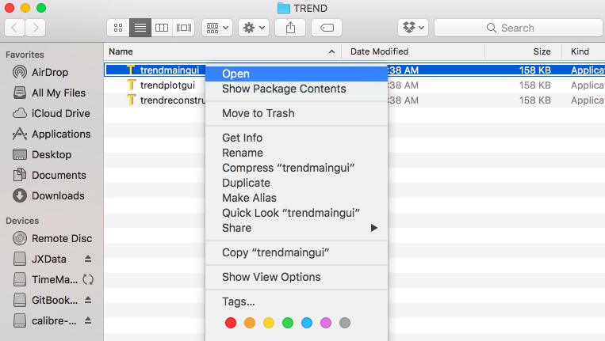

# Known limitations by operating system

## macOS 10.12  
- macOS Sierra applies very strict safety policy. It does not provide 
`Allow app downloaded from anywhere` option anymore. Therefore TREND may 
fail to launch because of the following problem  
   
- You can override the security settings as described by
  [https://support.apple.com/kb/PH25088?viewlocale=en_US&locale=en_US](https://support.apple.com/kb/PH25088?viewlocale=en_US&locale=en_US)  

	- To override your security settings and open the app anyway:
		- In the Finder, locate the app you want to open.
		- Don’t use Launchpad to do this. Launchpad doesn’t allow you to access the shortcut menu.
		- Control-click the app icon, then choose Open from the shortcut menu.
		- Click Open.  
  

- Or the gatekeeper of Sierra could be disabled by running the following commands, 
see [https://www.tekrevue.com/tip/gatekeeper-macos-sierra/](https://www.tekrevue.com/tip/gatekeeper-macos-sierra/)  
```bash
sudo spctl --master-disable  
```  

## OS X 10.11
- The strict safety precautions of El Capitan prevent double clicking or 
use of the open command in terminal from launching TREND apps. The TREND 
apps may nonetheless be launched in a terminal (text) window. To enable 
opening of the apps by double clicking, enter the system preferences menu 
and go to `Security & Privacy` and select `Allow app downloaded from anywhere`, 
at least temporarily until you have run each of the apps.

## OS X 10.7 to 10.8  
- `GIF movie` option of `trendreconstruct` is not supported  

## Fedora 23  
- `trendmain` and `trendreport` are not able to launch web browser to 
open `-report.html` automatically  

If you have any question, please contact <trendmizzou@gmail.com>
