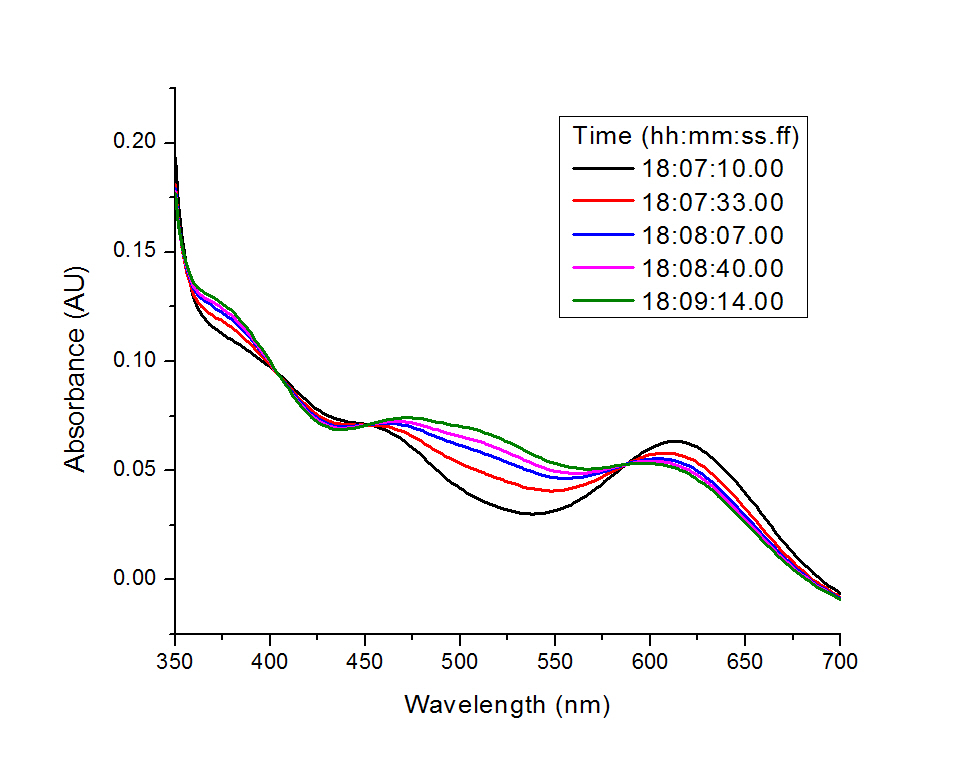

## Tutorial: The Kinetics of Aqutaion of trans-[Co(en)<sub>2</sub>Cl<sub>2</sub>]<sup>+</sup>
### Introduction  
- [JCAMP-DX](http://www.jcamp-dx.org) is an internationally accepted format 
that is suitable for spectra collected from various spectroscopy instruments. 
JCAMP-DX can be used to store a series of spectra using its multi **BLOCKS**   
- Here is a simple example of analyzing kinetics of aquation of trans-[Co(en)
<sub>2</sub>Cl<sub>2</sub>]<sup>+</sup> from a single JCAMP-DX 
[file](http://wwwchem.uwimona.edu.jm:1104/spectra/testdata/blckpac1.jdx), 
which includes a series Vis spectra using 5 data blocks  
- More examples of JCAMP-DX data can be found in [http://wwwchem.uwimona.edu.jm:1104/spectra/testdata/index.html](http://wwwchem.uwimona.edu.jm:1104/spectra/testdata/index.html)
- Basic information of the experiments can be found in the header of the 
downloaded [`blckpac1.jdx`](http://wwwchem.uwimona.edu.jm:1104/spectra/testdata/blckpac1.jdx) file.  
```bash
##TITLE= Aquation of trans-[Co(en)2Cl2]+
##DATA TYPE= LINK
##BLOCKS= 5
##ORIGIN= Dept of Chem, UWI, Mona, JAMAICA
##OWNER= public domain
##TITLE= (t1) Aquation of trans-[Co(en)2Cl2]+
##JCAMP-DX= 4.24
##DATA TYPE= UV/VIS SPECTRUM
##BLOCK_ID=1
##ORIGIN= Dept of Chem, UWI, Mona, JAMAICA $$Exported PE UV WinLab Data File
##OWNER= public domain
##DATE= 96/11/04
##TIME= 18:07:10.00
##SPECTROMETER/DATA SYSTEM= PERKIN-ELMER LAMBDA 19 UV/VIS/NIR UV
```
- The Vis spectra series can be visualized as:   



### Steps
#### 1. Prepare the time axis (optional)  
